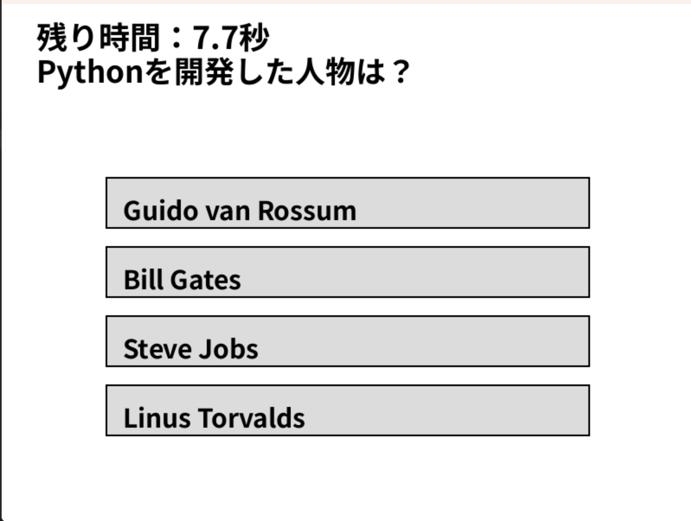

# 4択クイズゲーム

## 実行環境の必要条件
* python >= 3.10
* pygame >= 2.1

## ゲームの概要
* 四択クイズ

## ゲームの遊び方
* スタート画面が表示されるのでスタートボタンをクリックする
* 四択から正解だと思うものをクリックする
* 正誤判定のあと、スペースキーを押すと次の問題に移る
* すべての問題を終えるとリザルト画面が表示されるのでもう一度遊びたければスタートに戻るボタンをクリック、終了したければ×ボタンをクリック

## ゲームの実装
### 共通基本機能
* 問題と4つの選択肢を表示し、正誤判定を行う

### 分担追加機能
* 50-50(担当:田島):Fキーでゲーム中1回のみ選択肢を半分に絞る機能

* スタート画面の追加(担当：木村)
* spaceキーで次の問題に行けることを画面表示
* 正解問題数をカウントし追加したリザルト画面に表示
* 不正解時に誤って選択した選択肢を赤くハイライト

* タイマー追加(担当：塚越)：制限時間を追加する機能

* 効果音追加(担当:菅原):出題、正解、不正解で鳴る効果音の追加
